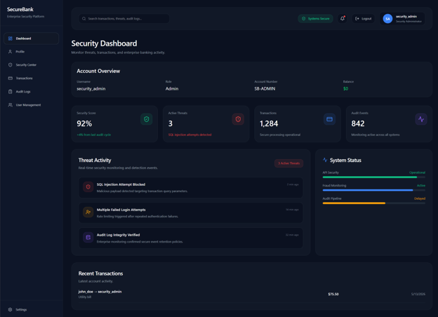
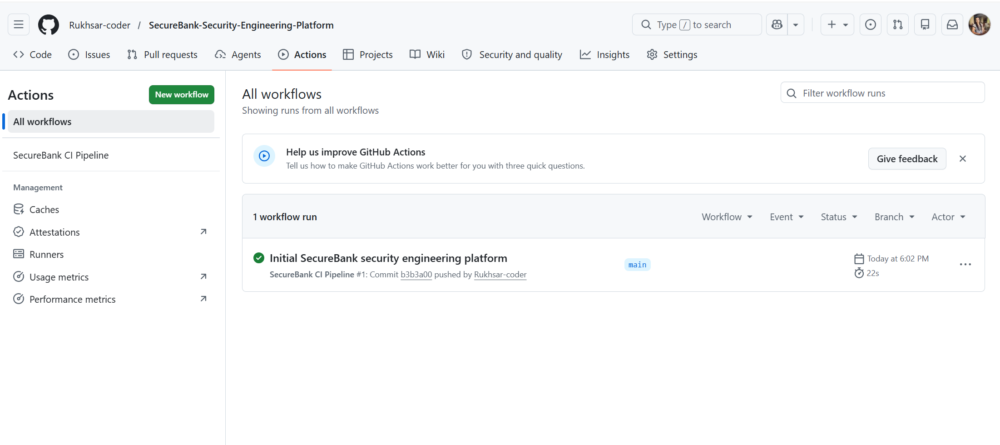
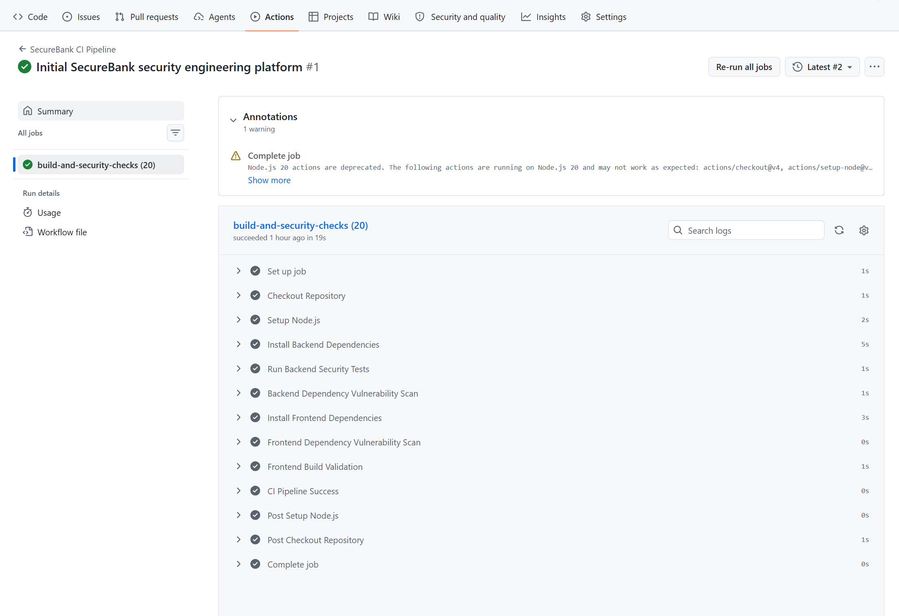
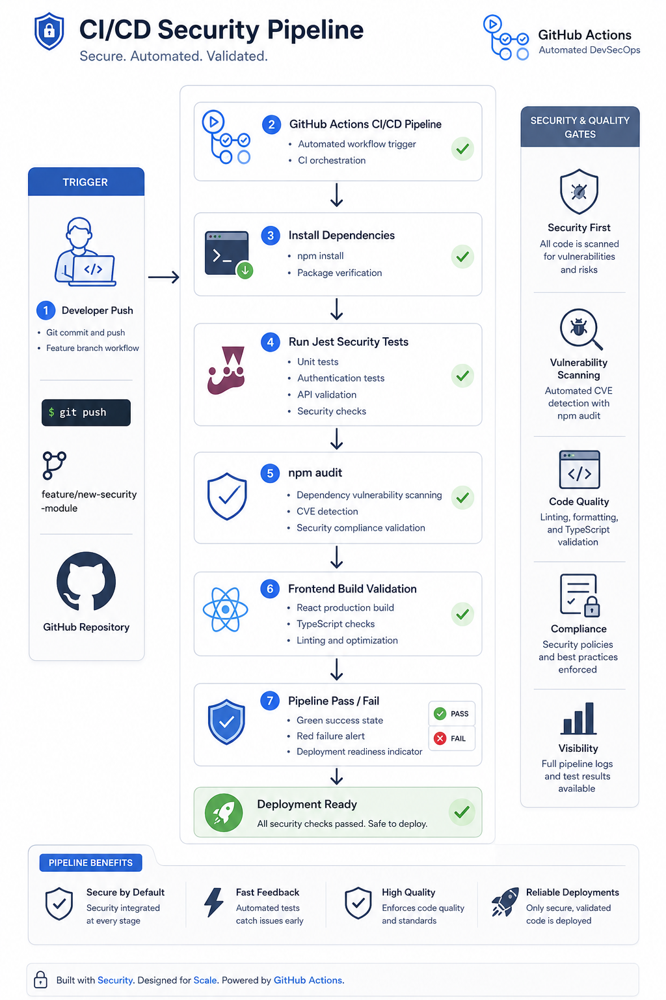

# SecureBank

SecureBank is a full-stack security engineering platform built to demonstrate modern application security, SOC monitoring, and DevSecOps workflows.

The project simulates realistic security scenarios where vulnerabilities are intentionally introduced, exploited, remediated, monitored, and later validated through automated security testing and CI/CD pipelines.

---

# Project Overview

SecureBank focuses on the complete security lifecycle:

```text
Build → Exploit → Detect → Remediate → Monitor → Automate
```

The platform combines:

- Application Security (AppSec)
- Security Operations (SOC)
- DevSecOps
- Secure API Engineering
- CI/CD Security Automation

---

# Core Features

| Feature                          | Status      |
| -------------------------------- | ----------- |
| JWT Authentication               | Implemented |
| Role-Based Access Control (RBAC) | Implemented |
| Protected API Routes             | Implemented |
| IDOR Prevention                  | Implemented |
| Secure File Upload Validation    | Implemented |
| Security Event Monitoring        | Implemented |
| SOC Telemetry Dashboard          | Implemented |
| Jest Security Testing            | Implemented |
| GitHub Actions CI/CD             | Implemented |
| Dockerized Infrastructure        | Implemented |

---

# Architecture Overview


SecureBank follows a modular security-focused architecture designed around separation of concerns, protected APIs, telemetry collection, and operational monitoring.

## Architecture Components

### Frontend

- React
- Vite
- Tailwind CSS
- Axios
- React Router

### Backend

- Node.js
- Express.js
- JWT Authentication
- RBAC Middleware
- PostgreSQL
- Multer Upload Validation

### Security Operations

- Security telemetry collection
- Audit event logging
- Threat monitoring
- Operational dashboards

### Infrastructure

- Docker
- Docker Compose
- GitHub Actions
- CI/CD automation

---

# Application Preview

## Login Page


---

## Admin Dashboard



---

## Customer Dashboard


---

## Security Operations Center


---

## Audit Logs


---

# Security Case Studies

SecureBank includes controlled security scenarios used to demonstrate vulnerability exploitation, remediation, and monitoring workflows.

---

# 1. Broken Access Control (RBAC)

Customer users attempted to access administrator-only security telemetry endpoints.

## Protected Endpoint

```text
/api/security/events
```

---

## Unauthorized Access Attempt


The request was denied using backend role validation middleware.

---

## Security Controls Implemented

- JWT role claims
- Role validation middleware
- Protected admin routes
- Access denial handling
- Security event generation

---

# 2. IDOR (Insecure Direct Object Reference)

SecureBank demonstrates object-level authorization using transaction ownership validation.

The vulnerable implementation originally allowed users to access another user's transaction by modifying transaction IDs directly inside API requests.

---

## Vulnerable Request Example

```text
/api/transactions/1
/api/transactions/2
```

---

## Unauthorized Transaction Access


---

## Root Cause

The original backend implementation validated authentication but failed to verify transaction ownership.

---

## Remediation

Ownership validation was added before returning transaction data.

```js
if (transaction.sender !== req.user.username) {
  return res.status(403).json({
    message: "Access denied",
  });
}
```

---

## Fixed Access Control


---

## Security Improvements

- Object-level authorization
- Ownership validation
- Secure API access enforcement
- Backend access control protections

---

# 3. File Upload Security

SecureBank also demonstrates unrestricted file upload vulnerabilities and secure upload validation.

---

## Vulnerable Upload Configuration

The original implementation accepted unrestricted file uploads without validation.


---

## Malicious Upload Accepted

A malicious `.jsx` file was uploaded successfully in the vulnerable version.


---

# Secure Upload Remediation

MIME validation was later implemented using Multer file filtering.


```js
const allowedTypes = ["application/pdf", "image/png", "image/jpeg"];
```

---

## Valid Upload Result

Legitimate files continue to upload successfully.


---

## Blocked Malicious Upload

Invalid file uploads now generate validation failures.


---

## Security Concepts Demonstrated

- Unrestricted file upload risks
- MIME validation
- Secure upload handling
- Defense-in-depth validation
- Backend file filtering

---

# Security Operations & Monitoring

SecureBank includes SOC-style monitoring and operational telemetry tracking.

---

# RBAC Security Event Monitoring

Unauthorized administrative access attempts generate security telemetry events automatically.


---

## Example Security Event

```json
{
  "type": "RBAC_DENIED",
  "severity": "high",
  "user": "customer_user",
  "endpoint": "/api/security/events",
  "description": "Unauthorized access attempt"
}
```

---

## Backend Detection Logic

RBAC violations generate operational telemetry events inside the backend.


---

## Operational Terminal Logs

Authentication and authorization activity is logged operationally.


---

# Security Metrics API

SecureBank includes protected telemetry endpoints for operational monitoring.

---

## Unauthorized Metrics Access

Requests without authentication are denied.


---

## Authorized Metrics Access

Authenticated requests successfully retrieve telemetry data.


---

## Metrics Include

- Failed login attempts
- SQL injection detections
- Threat counters
- Security telemetry
- Protected API activity

---

# Security Testing

SecureBank includes automated backend security regression testing using Jest and Supertest.


---

# Security Test Coverage

## Authentication Middleware

- JWT validation
- Missing token handling
- Invalid token rejection

## RBAC Middleware

- Role validation
- Admin-only route protection
- Unauthorized request blocking

---

## Example Test Structure

```text
middleware/
├── authMiddleware.js
├── authMiddleware.test.js
├── roleMiddleware.js
├── roleMiddleware.test.js
```

---

## Run Tests

```bash
cd backend
npm test
```

---

# DevSecOps CI/CD

SecureBank integrates automated security validation using GitHub Actions.

---

## GitHub Actions Workflow



---

## Pipeline Execution



---

## CI/CD Security Pipeline



---

## Pipeline Capabilities

- Backend dependency installation
- Frontend dependency installation
- Automated security regression testing
- npm audit vulnerability scanning
- Frontend build validation
- Continuous integration security checks

---

## Workflow Location

```text
.github/workflows/ci.yml
```

---

# Dockerized Infrastructure

SecureBank runs using Dockerized services managed through Docker Compose.

---

# Services

- Backend API container
- PostgreSQL database container
- Shared internal Docker networking
- Environment-based configuration

---

## Start Environment

```bash
docker compose up --build
```

---

# Technical Stack

## Frontend

- React
- Vite
- Tailwind CSS
- Axios
- React Router
- Lucide React

---

## Backend

- Node.js
- Express.js
- PostgreSQL
- JWT
- Multer
- Jest
- Supertest

---

## Infrastructure

- Docker
- Docker Compose
- GitHub Actions

---

# Security Engineering Skills Demonstrated

- Application Security (AppSec)
- RBAC Authorization
- JWT Authentication
- Secure API Design
- IDOR Prevention
- Secure File Upload Validation
- SOC Monitoring
- Security Telemetry
- Detection Engineering
- Audit Logging
- Docker Infrastructure
- Security Regression Testing
- CI/CD Security Automation
- DevSecOps Engineering

---

# Additional Documentation

| Document                    | Description                             |
| --------------------------- | --------------------------------------- |
| docs/architecture.md        | System architecture and platform design |
| docs/remediation-summary.md | Vulnerability remediation walkthroughs  |
| docs/deployment-notes.md    | Deployment and Docker notes             |

---

# Future Improvements

Planned future enhancements include:

- Trivy container scanning
- Semgrep SAST integration
- GitHub CodeQL analysis
- AWS deployment
- Persistent telemetry storage
- SIEM integration
- Infrastructure-as-Code security
- Secret scanning
- Docker hardening

---

# Final Notes

SecureBank was built to simulate realistic security engineering workflows across application security, operational monitoring, and DevSecOps automation.

The project combines vulnerability remediation, backend security controls, telemetry monitoring, automated testing, and CI/CD validation inside a modern full-stack environment.

This repository was designed as a practical security engineering portfolio project focused on defensive security engineering concepts and secure software development practices.
