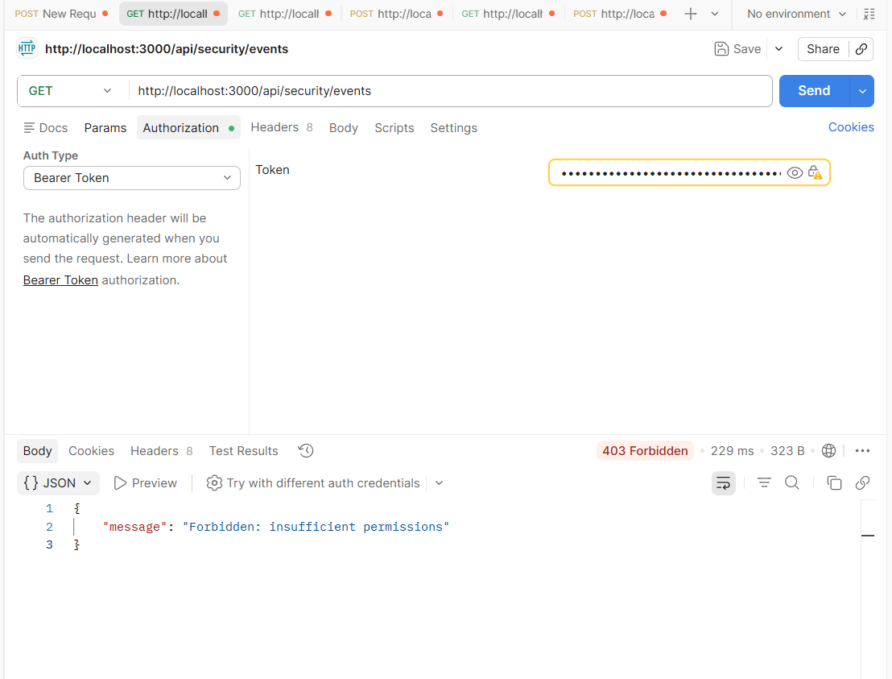
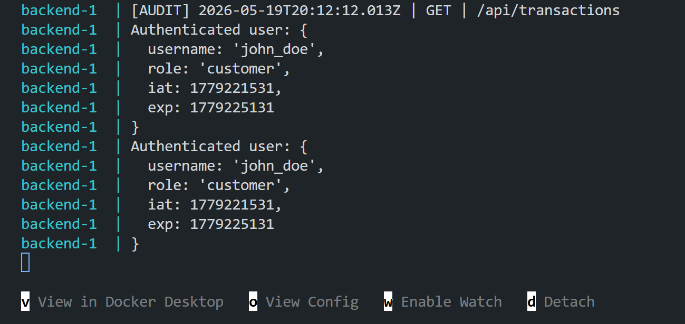

# SecureBank

SecureBank is a full-stack fintech security engineering platform built to demonstrate modern AppSec, SOC monitoring, and DevSecOps workflows.

This project follows a real security lifecycle:

**Build → Break → Exploit → Fix → Monitor → Automate → Deploy**

SecureBank is not a basic banking dashboard. It is designed as a realistic enterprise-style security platform where vulnerabilities are intentionally introduced, exploited, remediated, monitored, and later validated through CI/CD automation.

---

## Table of Contents

- [Application Preview](#application-preview)
- [Security Engineering Features](#security-engineering-features)
- [AppSec Case Studies](#appsec-case-studies)
- [Security Operations Monitoring](#security-operations-monitoring)
- [Security Testing](#security-testing)
- [DevSecOps CI/CD](#devsecops-cicd)
- [Dockerized Infrastructure](#dockerized-infrastructure)
- [Technical Stack](#technical-stack)
- [Future Roadmap](#future-roadmap)

## Project Goals

SecureBank demonstrates:

- Secure full-stack application architecture
- JWT authentication
- Role-Based Access Control
- IDOR prevention and exploitation
- File upload security
- Security telemetry
- SOC-style event monitoring
- Dockerized backend and database
- Jest security regression testing
- GitHub Actions CI/CD security automation

---

## Application Preview

### Login Page


### Admin Dashboard


### Customer Dashboard


### Security Center


### Audit Logs


---

## Security Engineering Features

| Area                      | Status      |
| ------------------------- | ----------- |
| JWT Authentication        | Implemented |
| Protected Routes          | Implemented |
| RBAC Authorization        | Implemented |
| IDOR Protection           | Implemented |
| Upload Validation         | Implemented |
| Security Event Monitoring | Implemented |
| SOC Event Feed            | Implemented |
| Jest Security Tests       | Implemented |
| GitHub Actions CI/CD      | In Progress |
| Dockerized Services       | Implemented |

---

## AppSec Case Studies

SecureBank includes controlled vulnerability demonstrations.

### 1. Broken Access Control (RBAC)

A customer user was prevented from accessing admin-only security telemetry.


Security controls demonstrated:

- JWT role claims
- Backend role middleware
- Admin-only routes
- Forbidden access handling
- Security event logging

---

### 2. IDOR (Insecure Direct Object Reference)

SecureBank demonstrates object-level authorization using transaction ownership validation.

The vulnerable version allowed users to access another user's transaction by changing the transaction ID.


Remediation:

```js
if (transaction.sender !== req.user.username) {
  return res.status(403).json({
    message: "Access denied",
  });
}
```

---

## Validation

After remediation, unauthorized transaction access is blocked.


This demonstrates:

- Object-level authorization
- Ownership validation
- Secure API access enforcement
- Backend access control protections

---

### 3. File Upload Security

SecureBank demonstrates unrestricted file upload vulnerabilities and secure remediation workflows.

### Vulnerable Upload Configuration

The original implementation accepted unrestricted file uploads.


Malicious files such as `.jsx` were uploaded successfully.


---

### Secure Upload Remediation

MIME validation was implemented using Multer file filtering.


```js
const allowedTypes = ["application/pdf", "image/png", "image/jpeg"];
```

---

### Upload Validation Result

Legitimate files continue to upload successfully.


Blocked upload attempts generated validation failures.


---

### Security Engineering Insight

This case study demonstrates:

- Unrestricted file upload risk
- MIME validation
- Defense-in-depth concepts
- Validation bypass awareness
- Secure file handling strategies

---

## Security Operations Monitoring

SecureBank evolved beyond AppSec demonstrations into operational security telemetry monitoring.

---

### RBAC Security Event Detection

Unauthorized administrative access attempts are automatically detected and logged.



---

### Security Telemetry Feed

Security events are surfaced inside the Security Center dashboard.


Example event:

```json
{
  "type": "RBAC_DENIED",
  "severity": "high",
  "user": "customer_user",
  "description": "Unauthorized attempt to access restricted operational resource",
  "endpoint": "/api/security/events"
}
```

---

### Backend Detection Engineering

RBAC violations trigger backend telemetry generation.


---

### Operational Backend Logging

Backend authentication and audit activity are logged operationally.


---

## Security Metrics API

SecureBank includes protected operational telemetry endpoints.

---

### Unauthorized Metrics Access

Requests without authentication are denied.


---

### Authorized Metrics Access

Authenticated users can access operational telemetry.


Metrics include:

- SQL injection attempts
- Failed logins
- Active threats
- Secure API request tracking

---

### Backend Authentication Logging

JWT authentication activity is logged server-side.



---

## Security Testing

SecureBank includes automated backend security regression testing using Jest and Supertest.


### Middleware Security Testing

Implemented test coverage includes:

- JWT authentication middleware
- RBAC authorization middleware
- Unauthorized request validation
- Token validation workflows

Example test structure:

```text
middleware/
├── authMiddleware.js
├── authMiddleware.test.js
├── roleMiddleware.js
├── roleMiddleware.test.js
```

Run tests:

```bash
cd backend
npm test
```

---

## DevSecOps CI/CD

SecureBank includes GitHub Actions security automation workflows.

Pipeline capabilities:

- Backend dependency installation
- Frontend dependency installation
- Security regression testing
- npm dependency auditing
- Frontend build validation

Workflow location:

```text
.github/workflows/ci.yml
```

---

## Dockerized Infrastructure

SecureBank runs inside Dockerized services using Docker Compose.

Infrastructure includes:

- Backend container
- PostgreSQL container
- Shared internal networking
- Environment-based configuration

Start environment:

```bash
docker compose up --build
```

---

## Technical Stack

### Frontend

- React
- Vite
- Tailwind CSS
- Axios
- React Router
- Lucide React

### Backend

- Node.js
- Express
- PostgreSQL
- JWT
- Multer
- Jest
- Supertest

### Infrastructure

- Docker
- Docker Compose
- GitHub Actions

---

## Security Engineering Concepts Demonstrated

| Security Area         | Demonstrated |
| --------------------- | ------------ |
| Authentication        | Yes          |
| Authorization         | Yes          |
| RBAC                  | Yes          |
| IDOR Prevention       | Yes          |
| Upload Validation     | Yes          |
| Security Monitoring   | Yes          |
| Audit Logging         | Yes          |
| Detection Engineering | Yes          |
| SOC Telemetry         | Yes          |
| Security Testing      | Yes          |
| DevSecOps             | Yes          |
| CI/CD Automation      | Yes          |

---

## Future Roadmap

Planned future improvements:

- Trivy container scanning
- Semgrep SAST
- CodeQL analysis
- Secret scanning
- Docker hardening
- AWS deployment
- Persistent telemetry storage
- Exportable audit reports
- SIEM integration
- Infrastructure-as-Code security

---

## Lessons Learned

SecureBank demonstrates that modern security engineering extends far beyond vulnerability remediation.

This project emphasizes:

- Secure software development
- Security monitoring
- Operational visibility
- Defensive engineering
- CI/CD security automation
- Full-stack security architecture

The project intentionally combines:

- AppSec
- SOC workflows
- DevSecOps
- Secure engineering practices

within a realistic enterprise-style application.

---

## Final Summary

SecureBank is a practical security engineering platform designed to demonstrate:

- Vulnerability simulation
- Secure remediation
- Operational monitoring
- Security telemetry
- Automated testing
- CI/CD security integration
- Dockerized deployment workflows

This project was built to showcase real-world defensive security engineering concepts in a modern full-stack environment.

---

## Architecture Overview


SecureBank follows a modular enterprise security architecture.

### Backend

- Node.js
- Express.js
- JWT Authentication
- RBAC Middleware
- PostgreSQL
- Multer Upload Validation
- Security Telemetry Engine

### Frontend

- React
- Vite
- Axios
- Security Operations Dashboard
- Audit Monitoring UI

### Security Engineering

- IDOR Prevention
- Access Control Enforcement
- Secure File Upload Validation
- SOC Event Monitoring
- Security Audit Logging
- Dockerized Infrastructure
- CI/CD Security Automation

## DevSecOps CI/CD

SecureBank integrates automated security validation into the CI/CD pipeline using GitHub Actions.

### CI/CD Security Workflow


### Pipeline Capabilities

- Automated Jest regression testing
- Backend dependency installation
- Security-focused test execution
- npm audit vulnerability scanning
- Continuous security validation

### GitHub Actions Workflow

```yaml
name: SecureBank CI Pipeline

on:
  push:
    branches:
      - main
  pull_request:
    branches:
      - main

jobs:
  security-pipeline:
    runs-on: ubuntu-latest

    steps:
      - name: Checkout Repository
        uses: actions/checkout@v4

      - name: Setup Node.js
        uses: actions/setup-node@v4
        with:
          node-version: 20

      - name: Install Backend Dependencies
        working-directory: ./backend
        run: npm install

      - name: Run Backend Security Tests
        working-directory: ./backend
        run: npm test

      - name: Backend Security Audit
        working-directory: ./backend
        run: npm audit --audit-level=high
```

---

## Security Testing

SecureBank includes backend regression testing using Jest.

### Implemented Tests

| Test                   | Purpose                        |
| ---------------------- | ------------------------------ |
| authMiddleware.test.js | JWT authentication validation  |
| roleMiddleware.test.js | RBAC authorization enforcement |

### Example Test Execution

```bash
npm test
```

---

## Dockerized Infrastructure

SecureBank runs inside a containerized environment using Docker Compose.

### Services

- Backend API
- PostgreSQL Database

### Run Project

```bash
docker compose up --build
```

---

## Security Engineering Skills Demonstrated

This project demonstrates practical experience with:

- Application Security (AppSec)
- Access Control Enforcement
- OWASP Vulnerability Mitigation
- Security Monitoring
- Security Operations (SOC)
- JWT Authentication
- RBAC Authorization
- Docker
- CI/CD Security Automation
- Backend Security Testing
- DevSecOps Engineering
- Secure API Design
- Security Event Telemetry

---
