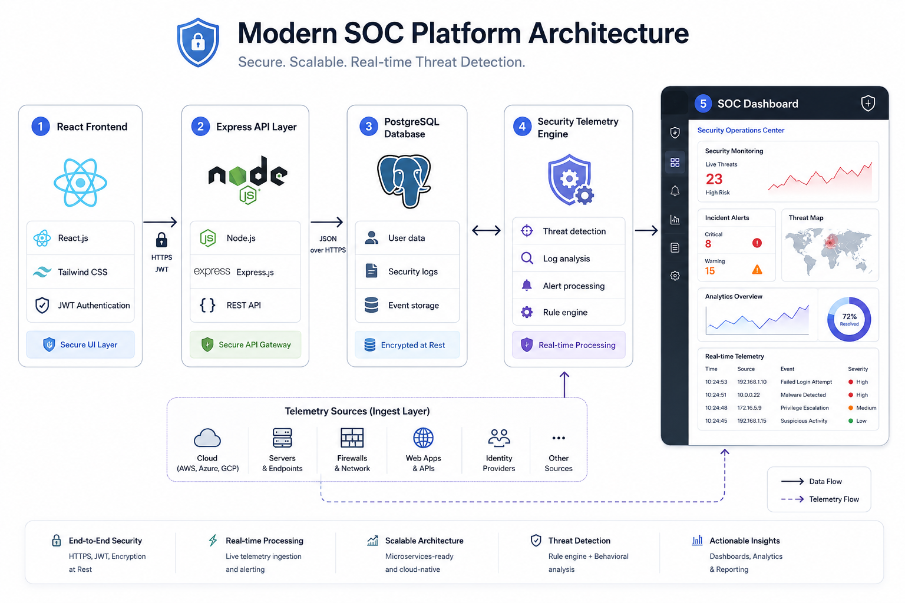

# SecureBank Architecture Documentation

## Overview

SecureBank follows a modular security-focused architecture designed to demonstrate modern AppSec, SOC monitoring, and DevSecOps engineering practices.

---

## High-Level Architecture

---

## Frontend Layer

Technologies:

- React
- Vite
- Tailwind CSS
- Axios
- React Router

Responsibilities:

- Dashboard rendering
- Security monitoring UI
- Authentication token storage
- API communication
- Audit visualization

---

## Backend API Layer

Technologies:

- Node.js
- Express.js
- JWT Authentication
- RBAC Middleware

Responsibilities:

- Authentication validation
- Route protection
- Security event generation
- Audit logging
- File upload validation
- Transaction authorization

---

## Database Layer

Technology:

- PostgreSQL

Stored Data:

- Users
- Transactions
- Security telemetry
- Audit events

---

## Security Telemetry Engine

The telemetry layer captures:

- RBAC violations
- Failed authentication attempts
- Security monitoring metrics
- Audit activity
- Threat detection events

---

## CI/CD Security Pipeline

SecureBank integrates GitHub Actions for automated security validation.

Pipeline stages:

1. Dependency installation
2. Jest security testing
3. npm audit scanning
4. Frontend validation
5. Deployment readiness checks

---

## Containerized Infrastructure

SecureBank runs inside Docker containers using Docker Compose.

Services include:

- Backend API container
- PostgreSQL database container

---

## Security Controls

Implemented controls:

- JWT authentication
- Role-Based Access Control
- Object-level authorization
- Upload MIME validation
- Security event logging
- Audit monitoring
